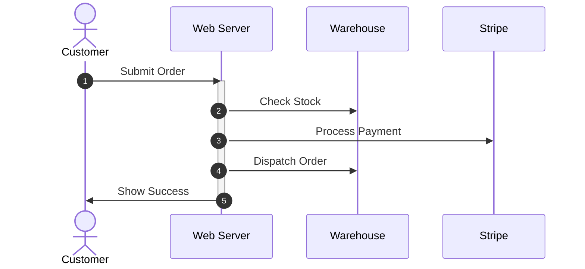

# Mermaid Sequence Diagram

Customer order submission

```mermaid
sequenceDiagram
    autonumber
    actor C as Customer
    participant WS as Web Server
    participant WH as Warehouse
    participant S as Stripe

    C->>WS: Submit Order
    activate WS
    WS->>WH: Check Stock
    WS->>S: Process Payment
    WS->>WH: Dispatch Order
    WS->>C: Show Success
    deactivate WS

```
